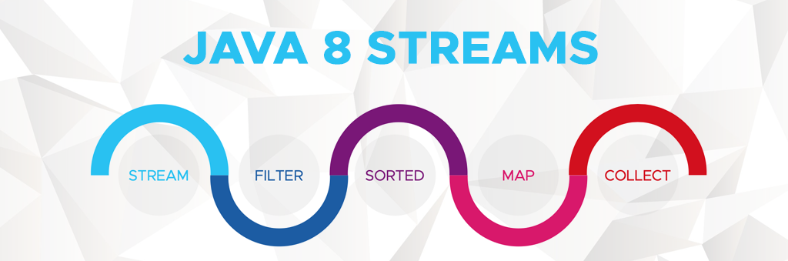

# java-stream

## Operações

### Intermediárias:

- distinct
- filter
- map
- peek
- sorted
- skip

### Short Circuit

- limit
- skip

### Terminais

- toArray
- collect
- count
- reduce
- forEach
- forEachOrdered
- min
- max
- anyMatch
- allMatch
- noneMatch
- findAny
- findFirst

Links úteis:
https://www.baeldung.com/java-difference-map-and-flatmap
https://www.youtube.com/watch?v=CwvlS3ViGFQ
https://www.youtube.com/watch?v=ZskH9Wlb2f0